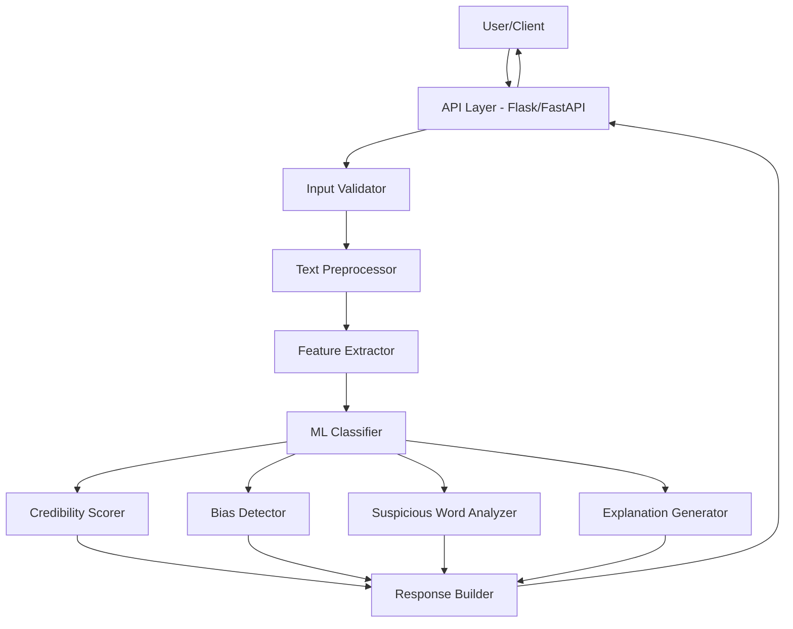

# Design Document: AI Fake News and Misinformation Detection System

## Overview

The AI Fake News and Misinformation Detection System is a machine learning-powered application that analyzes news content to identify fake, biased, or misleading information. The system employs Natural Language Processing (NLP) techniques for text preprocessing, machine learning models for classification, and analytical modules for credibility scoring, bias detection, and explanation generation.

The architecture follows a pipeline design where user input flows through preprocessing, feature extraction, classification, and post-processing stages before returning structured results. The system is designed to be stateless, scalable, and accessible via a RESTful API.

## Architecture




### Component Layers

1. **API Layer**: Handles HTTP requests, routing, and response formatting
2. **Validation Layer**: Validates input content against requirements
3. **Preprocessing Layer**: Normalizes and prepares text for analysis
4. **Feature Extraction Layer**: Converts text to numerical representations
5. **Classification Layer**: Predicts content category using trained ML model
6. **Analysis Layer**: Generates credibility scores, detects bias, identifies suspicious words
7. **Explanation Layer**: Creates human-readable justifications
8. **Response Layer**: Assembles final JSON output

## Data Flow

### Complete Processing Pipeline

```
1. User Input (Raw Text)
   ↓
2. Input Validation
   - Check length (10-10,000 characters)
   - Verify non-empty content
   - Validate character encoding
   ↓
3. Text Preprocessing
   - Lowercase conversion
   - Special character removal
   - Tokenization
   - Stopword removal
   ↓
4. Feature Extraction
   - TF-IDF vectorization
   - Generate numerical feature vector
   ↓
5. Classification
   - Model prediction (Real/Fake/Biased)
   - Confidence probability extraction
   ↓
6. Parallel Analysis
   ├─ Credibility Scoring (uses prediction + confidence)
   ├─ Bias Detection (analyzes language patterns)
   ├─ Suspicious Word Identification (flags problematic terms)
   └─ Explanation Generation (synthesizes reasoning)
   ↓
7. Response Assembly
   - Combine all analysis results
   - Format as JSON
   - Add timestamp
   ↓
8. Output to User
```

### Data Structures

**Input Schema:**
```json
{
  "content": "string (10-10,000 characters)"
}
```

**Output Schema:**
```json
{
  "classification": "Real | Fake | Biased",
  "credibility_score": "integer (0-100)",
  "bias_indicator": "boolean or string",
  "suspicious_words": [
    {
      "word": "string",
      "position": "integer",
      "reason": "string"
    }
  ],
  "explanation": "string (20-500 characters)",
  "timestamp": "ISO 8601 datetime"
}
```

## Components and Interfaces

### 1. API Layer (Flask/FastAPI)

**Responsibility**: Handle HTTP requests and responses

**Interface:**
```python
POST /api/analyze
Request Body: {"content": "news text"}
Response: JSON with classification results
Status Codes: 200 (success), 400 (validation error), 500 (server error)
```

**Implementation Notes:**
- Use Flask or FastAPI for lightweight REST API
- Enable CORS for web client access
- Implement request logging for monitoring
- Set timeout of 20 seconds per request

### 2. Input Validator

**Responsibility**: Validate user input against requirements

**Interface:**
```python
def validate_input(content: str) -> ValidationResult:
    """
    Validates input content.
    
    Returns:
        ValidationResult with is_valid flag and error_message if invalid
    """
```

**Validation Rules:**
- Length: 10 ≤ len(content) ≤ 10,000
- Content must not be only whitespace
- Must contain alphanumeric characters

### 3. Text Preprocessor

**Responsibility**: Clean and normalize text using NLP techniques

**Interface:**
```python
def preprocess(content: str) -> PreprocessedText:
    """
    Preprocesses raw text for classification.
    
    Returns:
        PreprocessedText containing tokens and normalized text
    """
```

**Processing Steps:**
1. **Lowercase Conversion**: Convert all text to lowercase for consistency
2. **Special Character Removal**: Remove non-alphanumeric characters except spaces and basic punctuation
3. **Tokenization**: Split text into individual words using NLTK or spaCy
4. **Stopword Removal**: Remove common words (the, is, at, etc.) using NLTK stopword list
5. **Preserve Original**: Keep original text for suspicious word position mapping

**Libraries**: NLTK, spaCy

### 4. Feature Extractor

**Responsibility**: Convert preprocessed text to numerical features

**Interface:**
```python
def extract_features(preprocessed_text: PreprocessedText) -> FeatureVector:
    """
    Extracts TF-IDF features from preprocessed text.
    
    Returns:
        FeatureVector suitable for ML model input
    """
```

**Implementation:**
- Use TF-IDF (Term Frequency-Inverse Document Frequency) vectorization
- Vocabulary size: 5,000-10,000 most common terms from training data
- N-gram range: unigrams and bigrams (1-2)
- Load pre-fitted TF-IDF vectorizer from training phase

**Libraries**: scikit-learn TfidfVectorizer

### 5. ML Classifier

**Responsibility**: Predict content classification using trained model

**Interface:**
```python
def classify(features: FeatureVector) -> ClassificationResult:
    """
    Classifies content as Real, Fake, or Biased.
    
    Returns:
        ClassificationResult with prediction and confidence probabilities
    """
```

**Model Options:**
- **Logistic Regression**: Fast, interpretable, good for text classification
- **Naive Bayes**: Efficient for text, handles high-dimensional data well

**Training:**
- Dataset: FakeNewsNet or Kaggle Fake News Dataset
- Split: 70% training, 15% validation, 15% test
- Target accuracy: ≥80% on test set
- Multi-class classification: Real vs Fake vs Biased

**Model Persistence:**
- Save trained model using joblib or pickle
- Load model at application startup
- Version models for reproducibility

### 6. Credibility Scorer

**Responsibility**: Generate credibility score (0-100) based on classification

**Interface:**
```python
def calculate_credibility(classification: str, confidence: float, 
                         linguistic_features: dict) -> int:
    """
    Calculates credibility score from 0-100.
    
    Returns:
        Integer credibility score
    """
```

**Scoring Logic:**
- **Base Score**: Derived from model confidence probability
  - Fake: confidence * 40 (maps to 0-40 range)
  - Biased: 30 + (confidence * 40) (maps to 30-70 range)
  - Real: 60 + (confidence * 40) (maps to 60-100 range)
- **Adjustments**: Apply penalties/bonuses based on:
  - Number of suspicious words (-5 per word, max -20)
  - Sentence complexity indicators
  - Presence of sources or citations (+5 if detected)

### 7. Bias Detector

**Responsibility**: Identify systematic bias in content

**Interface:**
```python
def detect_bias(content: str, tokens: list) -> BiasResult:
    """
    Detects presence and type of bias.
    
    Returns:
        BiasResult with indicator and bias type
    """
```

**Detection Methods:**
1. **Emotional Language**: Count emotionally charged words using sentiment lexicon
2. **Political Keywords**: Identify partisan language patterns
3. **Sensationalism**: Detect exaggerated claims and superlatives
4. **Source Framing**: Analyze one-sided presentation patterns

**Threshold**: Flag as biased if bias score exceeds 0.6 on 0-1 scale

**Libraries**: NLTK SentimentIntensityAnalyzer, custom bias lexicon

### 8. Suspicious Word Analyzer

**Responsibility**: Identify misleading or manipulative words/phrases

**Interface:**
```python
def identify_suspicious_words(content: str, tokens: list) -> List[SuspiciousWord]:
    """
    Identifies suspicious words and their positions.
    
    Returns:
        List of SuspiciousWord objects with word, position, and reason
    """
```

**Detection Categories:**
1. **Sensationalist Terms**: "shocking", "unbelievable", "you won't believe"
2. **Emotional Manipulation**: "outrage", "terrifying", "devastating"
3. **Absolute Claims**: "always", "never", "everyone", "nobody"
4. **Clickbait Phrases**: "this one trick", "doctors hate", "secret revealed"
5. **Unverified Claims**: "reportedly", "allegedly" (without context)

**Implementation:**
- Maintain curated lexicon of suspicious terms
- Use regex patterns for phrase matching
- Map positions back to original text (before preprocessing)
- Limit to top 10 most suspicious words per analysis

### 9. Explanation Generator

**Responsibility**: Create human-readable explanation for classification

**Interface:**
```python
def generate_explanation(classification: str, credibility_score: int,
                        suspicious_words: List[SuspiciousWord],
                        bias_result: BiasResult) -> str:
    """
    Generates explanation for classification decision.
    
    Returns:
        String explanation (20-500 characters)
    """
```

**Explanation Templates:**
- **Fake (Low Credibility)**: "This content shows signs of misinformation with [X] suspicious words including '[word1]' and '[word2]'. The language patterns and lack of verifiable sources suggest unreliability."
- **Biased**: "This content exhibits [bias_type] bias through emotionally charged language and one-sided framing. While facts may be present, the presentation lacks neutrality."
- **Real (High Credibility)**: "This content appears credible with balanced language and factual presentation. [Minimal/No] suspicious indicators detected."

**Constraints:**
- Length: 20-500 characters
- Non-technical language
- Reference at least one factor (suspicious words, bias, language patterns)

### 10. Response Builder

**Responsibility**: Assemble final JSON response

**Interface:**
```python
def build_response(classification: str, credibility_score: int,
                  bias_indicator: bool, suspicious_words: List[SuspiciousWord],
                  explanation: str) -> dict:
    """
    Builds final JSON response.
    
    Returns:
        Dictionary ready for JSON serialization
    """
```

**Implementation:**
- Combine all analysis results
- Add ISO 8601 timestamp
- Ensure JSON serializable types
- Handle None values gracefully

## Data Models

### Core Data Classes

```python
@dataclass
class ValidationResult:
    is_valid: bool
    error_message: Optional[str] = None

@dataclass
class PreprocessedText:
    tokens: List[str]
    normalized_text: str
    original_text: str

@dataclass
class FeatureVector:
    features: np.ndarray
    feature_names: List[str]

@dataclass
class ClassificationResult:
    prediction: str  # "Real", "Fake", or "Biased"
    confidence: float  # 0.0 to 1.0
    probabilities: Dict[str, float]  # probability for each class

@dataclass
class SuspiciousWord:
    word: str
    position: int
    reason: str

@dataclass
class BiasResult:
    is_biased: bool
    bias_type: Optional[str]  # "emotional", "political", "sensational"
    bias_score: float  # 0.0 to 1.0

@dataclass
class AnalysisResponse:
    classification: str
    credibility_score: int
    bias_indicator: bool
    suspicious_words: List[SuspiciousWord]
    explanation: str
    timestamp: str
```

## Correctness Properties

*A property is a characteristic or behavior that should hold true across all valid executions of a system—essentially, a formal statement about what the system should do. Properties serve as the bridge between human-readable specifications and machine-verifiable correctness guarantees.*


### Property 1: Classification Validity

*For any* valid content input (10-10,000 characters), the system SHALL return exactly one classification from the set {Real, Fake, Biased}.

**Validates: Requirements 1.1, 1.3, 1.5**

### Property 2: Credibility Score Validity and Range Consistency

*For any* analyzed content, the credibility score SHALL be an integer between 0 and 100 inclusive, and SHALL fall within the valid range for its classification type (Fake: 0-40, Biased: 30-70, Real: 60-100).

**Validates: Requirements 2.1, 2.2, 2.3, 2.4, 2.5**

### Property 3: Response Structure Completeness

*For any* successful analysis, the response SHALL contain all required fields: classification, credibility_score, bias_indicator, suspicious_words, explanation, and timestamp.

**Validates: Requirements 1.2, 3.1, 4.1, 5.1, 9.2, 9.5**

### Property 4: Suspicious Word Position Mapping

*For any* suspicious word identified in the analysis, its position SHALL correspond to a valid location in the original input text where that word or phrase appears.

**Validates: Requirements 3.2**

### Property 5: High Credibility Suspicious Word Limit

*For any* content classified as Real with a credibility score above 80, the number of suspicious words SHALL be at most 2.

**Validates: Requirements 3.5**

### Property 6: Explanation Length and Content

*For any* classification result, the explanation SHALL be between 20 and 500 characters in length and SHALL reference at least one classification factor (suspicious words, bias, language patterns, or credibility indicators).

**Validates: Requirements 4.2, 4.3**

### Property 7: Suspicious Word Explanation Consistency

*For any* analysis where suspicious words are identified (list is non-empty), the explanation SHALL mention or reference the presence of suspicious words.

**Validates: Requirements 4.4**

### Property 8: Bias Indicator Type and Classification Consistency

*For any* analyzed content, the bias_indicator SHALL be a boolean or categorical string value, and WHEN classification is "Biased", the bias_indicator SHALL be true or "Biased".

**Validates: Requirements 5.2, 5.3**

### Property 9: Preprocessing Normalization

*For any* valid input content, the preprocessor SHALL produce normalized outptem SHALL process all requests and return valid responses for each, demonstrating concurrent processing capability.

**Validates: Requirements 8.4**

### Property 12: JSON Output Validity

*For any* system response (success or error), the output SHALL be valid JSON that can be parsed by standard JSON libraries and SHALL conform to the defined response schema.

**Validates: Requirements 9.1, 9.2, 9.4**

### Property 13: Error Response Structure

*For any* error condition (validation failure or internal error), the system SHALL return a JSON response containing an error message and appropriate HTTP status code (400-level for validation, 500-level for internal errors).

**Validates: Requirements 9.3, 12.1, 12.2**

### Property 14: Stateless Request Processing

*For any* sequence of requests, the system SHALL produce results that depend only on the current request input and not on any previous request state, demonstrating stateless operation.

**Validates: Requirements 11.4**

### Property 15: Prediction Consistency

*For any* identical input content submitted multiple times, the system SHALL return the same classification, credibility score, and bias indicator, demonstrating deterministic behavior.

**Validates: Requirements 11.5**

### Property 16: Security - No Internal Details in Errors

*For any* error response, the output SHALL NOT contain stack traces, (<10 characters)
   - Content too long (>10,000 characteation without explanation)
- **Logging**: Log all errors with request ID, timestamp, and stack trace (server-side only)
- **User-Friendly Messages**: Never expose internal details to users
- **Retry Logic**: For transient failures, suggest retry to user
- **Timeout Handling**: Return 503 Service Unavailable if processing exceeds 20 seconds

## Testing Strategy

### Dual Testing Approach

The system requires both unit testing and property-based testing for comprehensive coverage:

**Unit Tests** focus on:
- Specific examples of fake, real, and biased content
- Edge cases (minimum length, maximusting

**Test Configuration**:
- Minimum 100 iterations per property test
- Each test tagged with: **Feature: fake-news-detection, Property {N}: {property_text}**
- Random input generation strategies:
  - Valid content: 10-10,000 character strings with alphanumeric and punctuation
  - Invalid content: empty strings, whitespace-only, too short, too long
  - Suspicious content: strings containing known suspicious terms
  - Neutral content: strings with balanced, factual language

**Example Property Test Structure**:
```python
# Feature: fake-news-detection, Property 1: Classification Validity
@given(st.text(min_size=10, max_size=10000, alphabet=st.characters(whitelist_categories=('L', 'N', 'P'))))
@settings(max_examples=100)
def test_classification_validity(content):
    response = analyze_content(content)
    assert response['classification'] in ['Real', 'Fake', 'Biased']
```

### Unit Test Coverage

**Component Tests**:
1. Input Validator: Test all validation rules with specific examples
2. Text Preprocessor: Test normalization, tokenization, stopword removal
3. Feature Extractor: Test TF-IDF vectorization with known inputs
4. Classifier: Test predictions with labeled test data
5. Credibility Scorer: Test score calculation for each classification type
6. Bias Detector: Test bias detection with biae News: ~20,000 articles with labels

**Unit Test Examples**:
- 10 known fake news examples
- 10 known real news examples
- 10 known biased news examples
- 5 edge cases (very short, very long, special characters)

## Technology Stack

### Core Technologies

- **Language**: Python 3.9+
- **ML Framework**: scikit-learn 1.0+
- **NLP Libraries**: 
  - NLTK 3.8+ (tokenization, stopwords, sentiment)
  - spaCy 3.5+ (advanced NLP, optional)
- **Web Framework**: Flask 2.3+ or FastAPI 0.100+
- **Property Testing**: Hypothesis 6.80+
- **Unit Testing**: pytest 7.4+

### Key Libraries

```python
# requirements.txt
flask==2.3.0  # or fastapi==0.100.0
scikit-learn==1.3.0
nltk==3.8.1
numpy==1.24.0
pandas==2.0.0
hypothesis==6.80.0
pytest==7.4.0
joblib==1.3.0  # model persistence
python-dotenv==1.0.0  # configuration
gunicorn==21.0.0  # production server
```

### Development Tools

- **Version Control**: Git
- **Dependency Management**: pip + requirements.txt or Poetry
- **Code Quality**: pylint, black (formatting), mypy (type checking)
- **API Documentation**: Swagger/OpenAPI (via Flask-RESTX or FastAPI auto-docs)

## Deployment Architecture

### Application Structure

```
fake-news-detection/
├── app/
│   ├── __init__.py
│   ├── api.py              # Flask/FastAPI routes
│   ├── validator.py        # Input validation
│   ├── preprocessor.py     # Text preprocessing
│   ├── feature_extractor.py
│   ├── classifier.py       # ML model wrapper
│   ├── credibility_scorer.py
│   ├── bias_detector.py
│   ├── word_analyzer.py
│   ├── explainer.py
│   └── response_builder.py
├── models/
│   ├── classifier.pkl      # Trained model
│   ├── vectorizer.pkl      # TF-IDF vectorizer
│   └── suspicious_words.json
├── tests/
│   ├── unit/
│   └── property/
├── data/
│   ├── train/
│   ├── validation/
│   └── test/
├── requirements.txt
└── README.md
```

### Scalability Considerations

1. **Stateless Design**: No session state, enables horizontal scaling
2. **Model Loading**: Load model once at startup, share across requests
3. **Caching**: Cache TF-IDF vectorizer and suspicious word lexicon
4. **Load Balancing**: Deploy behind nginx or cloud load balancer
5. **Containerization**: Docker container for consistent deployment
6. **Auto-scaling**: Configure based on request rate and response time

### Performance Optimization

- **Batch Processing**: Process multiple requests in batches if needed
- **Model Optimization**: Use optimized scikit-learn models (e.g., SGDClassifier for large datasets)
- **Preprocessing Cache**: Cache preprocessed common phrases
- **Async I/O**: Use FastAPI with async endpoints for I/O-bound operations
- **Resource Limits**: Set memory and CPU limits to prevent resource exhaustion

## Future Enhancements

### Phase 2 Features

1. **Real-time URL Verification**
   - Fetch content from URLs
   - Verify source credibility
   - Check against fact-checking databases

2. **Multilingual Support**
   - Train models for multiple languages
   - Language detection
   - Cross-lingual fake news detection

3. **Deep Learning Models**
   - BERT-based semantic analysis
   - Transformer models for context understanding
   - Improved accuracy and explanation quality

4. **Browser Extension**
   - Chrome/Firefox extension
   - Real-time content analysis while browsing
   - Visual indicators on web pages

5. **Source Credibility Database**
   - Maintain database of known reliable/unreliable sources
   - Historical accuracy tracking
   - Community-driven source ratings

6. **Fact-Checking Integration**
   - Integration with fact-checking APIs (Snopes, FactCheck.org)
   - Cross-reference claims with verified facts
   - Provide links to fact-check articles

7. **User Feedback Loop**
   - Allow users to report incorrect classifications
   - Collect feedback for model improvement
   - Active learning to improve accuracy

8. **Advanced Analytics Dashboard**
   - Trend analysis of fake news topics
   - Geographic distribution of misinformation
   - Temporal patterns in fake news spread

### Technical Debt and Improvements

- **Model Versioning**: Implement MLflow or similar for model versioning
- **A/B Testing**: Framework for testing new models against production
- **Monitoring**: Add Prometheus metrics and Grafana dashboards
- **Rate Limiting**: Implement rate limiting to prevent abuse
- **Authentication**: Add API key authentication for production use
